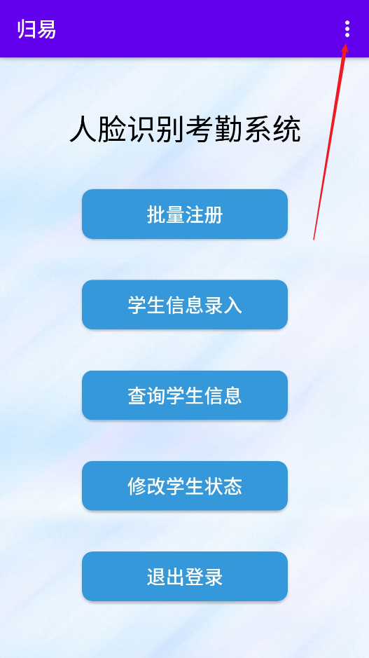

# FaceRecognition

归易——人脸识别考勤系统，2020夏季学期工业实训公开版

## 团队成员

1. 洪星月——组长
2. 董成相
3. 赵彦哲
4. 韩仪

## 所有仓库地址

1. `Github`：[点此前往](https://github.com/DongCX-LDHSP/FaceRecognition)，可在该仓库获取发行版
2. `Gitee`：[点此前往](https://gitee.com/rikdon/FaceRecognition)，政策限制，不绑定手机号无法上传附件，故无发行版
3. `Gitlab`：[点此前往](https://gitlab.com/Rik-Don/facerecognition)，受限于上传文件大小，无发行版

## 应用背景

随着时代的发展，学生人数日益增加，各大学校人员管理面临巨大的挑战，对学生考勤有着新的需求。人工考勤效率低、人为误差大、造成人力物力的浪费，已经不再适应时代的发展，随着计算机技术的发展，利用人脸识别对学校考勤有着高效的帮助，提高了工作效率和准确率。

我们做的项目是人脸识别考勤系统“**归易**”，客户端采用安卓平台运行，数据库使用`SQLite`建立。针对需求，用户分为学生和管理员。

## 如何安装该应用

### 思路一：开发人员自行打包安装

#### 方法一：直接使用真机进行调试

1. 使用Android Studio打开本项目
2. 连接真机
3. 点击运行

#### 方法二：打包成APK测试安装包

1. 使用Android Studio打开本项目

2. 依次点击菜单栏`Build -> Build Bundle(s) / APK(s) -> Build APK(s)`

3. 这里有两种方式找到打包完成的APK

    1. AS在Build完成之后，会在窗口的右下角弹出一个提示，点击`locate`即可

        

    2. 手动定位`./app/build/outputs/apk/debug/app-debug.apk`

4. 将安装包发送到手机安装

#### 方法三：打包成正式的发布安装包

1. 请参阅互联网资料进行打包
2. 将安装包发送到手机安装

### 思路二：直接使用Release安装包

1. 下载Release中的安装包（该安装包与思路一中的方法二相同）
2. 将安装包发送到手机安装

## `DatabaseHelper.java`文件中硬编码的测试数据

### 一、管理员用户

| 工号      | 密码 |
| --------- | ---- |
| 100000001 | abc  |
| 100000002 | abc  |
| 100000003 | abc  |

### 二、学生用户

| 学号      | 密码 |
| --------- | ---- |
| 201810325 | abc  |
| 201810324 | abc  |
| 201810329 | abc  |

### 三、学生信息

| 学号      | 姓名   | 班号    | 公寓楼号 | 寝室号 |
| --------- | ------ | ------- | -------- | ------ |
| 201810325 | 张三   | 2018103 | 5        | 414    |
| 201810326 | 王五   | 2018103 | 5        | 415    |
| 201810229 | 李四   | 2018102 | 5        | 414    |
| 201810324 | 张三丰 | 2018103 | 5        | 414    |
| 201810327 | 张无忌 | 2018103 | 5        | 415    |
| 201810329 | 周杰伦 | 2018103 | 5        | 415    |

### 四、签到结果

0表示未签到，1表示已签到

| 学号      | 密码                | 签到结果 |
| --------- | ------------------- | -------- |
| 201810329 | 2020-10-13 07:56:38 | 0        |
| 201810325 | 2020-10-13 08:02:33 | 0        |
| 201810329 | 2020-10-14 07:09:50 | 1        |
| 201810229 | 2020-10-13 06:55:20 | 1        |
| 201810325 | 2020-10-23 07:34:28 | 1        |
| 201810329 | 2020-10-03 07:34:54 | 1        |
| 201810329 | 2020-10-04 08:10:35 | 1        |
| 201810329 | 2020-10-05 08:05:40 | 1        |
| 201810324 | 2020-10-03 07:20:23 | 1        |
| 201810324 | 2020-10-13 08:00:23 | 0        |
| 201810329 | 2020-10-13 06:40:56 | 0        |

## 如何使用该应用

### 环境要求

1. Android armeabi-v7a
2. Android arm64-v8a

#### 环境确认方式

1. 使用`ADB`命令：[点此查看确认方式](https://blog.csdn.net/qq_36317441/article/details/89494686)
2. 打开本项目，在`AS`中连接真机，若不符合则会在选择设备的位置有相应提示

### 系统要求

1. Android `API Level 21` - `API Level 28`
2. `Android 5.0` - `Android 9`

### 使用准备

#### 第一步：注册成为`虹软视觉开放平台开发者`

1. [点击前往注册](https://ai.arcsoft.com.cn/ucenter/resource/build/index.html#/login)

2. 参阅新手指南获取`APP ID`和`SDK KEY`

    

#### 第二步：激活引擎

1. 启动APP，确保手机联网

2. 使用管理员账户登录

3. 点击右上角菜单中的激活引擎

    

4. 输入`APP ID`和`SDK KEY`

5. 点击`激活引擎`按钮

6. 提示`引擎初始化成功！`便说明激活成功，此后不需再次激活

    激活引擎在以下情况下会失效：

    1. 应用被卸载
    2. 手机硬件信息发生改变
    3. 重装系统
    4. 其他可能的情况

### 开始使用

#### 通用的功能

1. 找回密码
    1. 在登陆界面点击`找回密码`
    2. 输入用户名和新密码
    3. 点击`重置`按钮即可

#### 管理员的功能

1. 激活引擎，`使用准备`中已介绍，不再于此赘述
2. 批量注册
    1. 批量注册
        1. 将需要注册的人脸图片放到指定路径下
        2. 命名格式：学号.jpg
        3. 支持的图片格式：jpg
    2. 清空人脸库
3. 学生信息录入
    1. 录入学生的基本信息
    2. 给学生的账户设置密码
4. 查询学生信息，也就是以公寓楼号结合寝室号查询学生的签到信息
5. 修改学生状态，即修改学生的签到结果
    1. 输入待修改学生的学号
    2. 点击某一条记录便可以进行状态修改

#### 学生的功能

1. 人脸签到
    1. 人脸签到
        1. 自动追踪人脸相机中的人脸
        2. 仅在与人脸库中的人脸信息相符时提示签到成功，其他情况默认签到失败
    2. 注册，注册条件如下：
        1. 非当前用户不能注册，也就是当前识别出来的人脸已保存在人脸库中，并且不是当前登录的用户，不得注册
        2. 人脸库中已含有当前登录用户的人脸信息，不得重复注册
        3. 当检测到未知人脸时，并且人脸库中尚无当前登录用户的人脸信息，则可以进行注册
    3. 切换相机，切换前后置相机
2. 查看签到记录，用于让学生查看核对自己的签到结果

## 目录结构介绍

`./`表示`com.practice.facerecognition`

1. `./faceserver/`：该包是人脸识别API需要的包，直接由官方Demo项目移植而来
2. `./model/`：该包是人脸识别API需要的包，直接由官方Demo项目移植而来
3. `./util/`
    1. `./camera/`：该包是人脸识别API需要的包，直接由官方Demo项目移植而来
    2. `./face/`：该包是人脸识别API需要的包，直接由官方Demo项目移植而来
    3. `ConfigUtil.java`：该类是人脸识别API需要的类，直接由官方Demo项目移植而来
    4. `DatabaseHelper.java`：该类是数据库操作类，负责创建数据库表，并对外提供一些操作的接口，还负责向数据库表中插入测试数据
    5. `DrawHelper.java`：该类是人脸识别API需要的类，直接由官方Demo项目移植而来
    6. `TrackUtil.java`：该类是人脸识别API需要的类，直接由官方Demo项目移植而来
4. `./widget/`：该包是人脸识别API需要的包，直接由官方Demo项目移植而来
5. `./ActiveEngineActivity.java`：该类是激活引擎页面的代码
6. `./Amchange.java`：该类是管理员点击`修改学生信息`后跳转到的**输入学生学号**的页面
7. `./BaseActivity.java`：该类是由官方Demo项目移植而来，是Demo项目`activity`包里所有类的超类
8. `./changeResult.java`：该类是在**修改学生信息**时**输入学生学号**后跳转到的页面，在这里真正的**修改签到结果**
9. `./CheckingInActivity.java`：该类是在`查询学生信息`时，让用户选择宿舍及查询类型的页面
10. `./CheckingInSearchResultActivity.java`：该类是在**选择宿舍和查询类型**后跳转到的查询结果页面
11. `./FaceManageActivity.java`：该类是由官方Demo项目移植而来，基于项目需求进行了改写，负责**批量注册**和**清空人脸库**
12. `./LoginActivity.java`：该类是登陆页面，会对用户类型进行判断，然后分别跳转到**管理员主页面**和**学生主页面**
13. `./lookHistoryActivity.java`：该类是学生主页面的**查看签到记录**页面
14. `./MainActivity.java`：该类是学生主页面
15. `./ManagerMainActivity.java`：该类是管理员主页面
16. `./RegisterAndRecognizeActivity.java`：该类是学生主页面点击**人脸签到**后进入的页面，可以进行**单个人脸注册**和**签到**
17. `./SetPasswordActivity.java`：该类是登陆界面点击**找回密码**后跳转到的页面，负责**重置密码**
18. `./stuinfo.java`：该类是管理员主页面点击**学生信息录入**后进入的第一个界面，负责**录入学生的基本信息**
19. `./stupass.java`：该类是**录入了学生的基本信息**后跳转到的页面，负责**给学生用户设置登录密码**
20. `./WelcomeActivity.java`：该类是欢迎页面

## 程序的不足之处

1. 完全是本地操作，不贴近真实的应用环境
2. 退出登录的实现不太好，用户完全可以通过多次返回到达上一个页面，尚待优化
    1. 实训严老师的建议：跳转时使用`finish`方法
3. 程序在不同设备之间的兼容性不太好，团队成员的手机不都能正常运行
